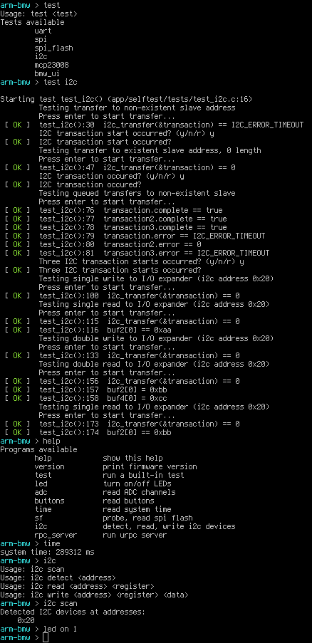

# arm-bmw-sw

A lightweight software library and selftest application for the [arm-bmw](http://theanine.io/projects/arm-bmw/) development board.

## Self-test Application

The self-test application provides a basic CLI over the UART with hardware unit tests and utility programs. The UART is configured for 115200 8N1, and the CLI may be accessed with your favorite serial port program.

The hardware unit tests include UART, SPI, I2C, SPI Flash, I/O Expander, and UI tests. These tests combine loopbacks and interactive verification to verify the correct operation of the hardware. See the tests in the [apps/selftest/tests](app/selftest/tests) folder for more information.



A passing test log can be found in [arm-bmw-selftest.log](arm-bmw-selftest.log).

## File Structure

 * `README.md` This README
 * `Makefile` Makefile
 * `LICENSE` MIT License
 * `lpc1114.dld` LPC1114 linker script
 * `openocd/` OpenOCD flash and debug scripts
 * `src/` Library sources
   * `system/` Startup files
     * `cmsis/` CMSIS header files
     * `lpc11xx/` LPC11xx header files
     * `startup.c` Interrupt vector table and reset handler
     * `tick.c`, `tick.h` SysTick handler and `delay_ms()` helper
   * `io/` peripheral I/O drivers
     * `uart.c`, `uart.h` Polling UART driver
     * `spi.c`, `spi.h` Polling SPI driver
     * `adc.c`, `adc.h` Polling ADC driver
     * `i2c.c`, `i2c.h` Interrupt-driven I2C driver
     * `queue.c`, `queue.h` Queue data structure for I2C driver
     * `i2c_reg.c`, `i2c_reg.h` I2C register read/write wrappers for I2C driver
   * `driver/` Chip Drivers
     * `mcp23008.c`, `mcp23008.h` I/O Expander driver
     * `sf.c`, `sf.h` SPI Flash driver
   * `debug.c`, `debug.h` Debug printf function
   * `test.h` Assertion framework/macros for testing
   * `bmw_ui.c`, `bmw_ui.h` Wrapper for BMW's User Interface (LEDs and buttons)
   * `ucli.c`, `ucli.h` µCLI Shell
   * `urpc.c`, `urpc.h` µRPC Server
 * `pybmw/` Python µRPC client
   * `urpc.py` µRPC client
 * `app/` Applications sources
   * `selftest` Self-test application
    * `main.c` Self-test main
    * `cli_programs.c` Self-test CLI handlers
    * `rpc_handlers.c` Self-test RPC handlers
    * `tests/` Self-test tests
      * `tests.h` Test prototypes
      * `test_uart.c` UART test
      * `test_spi.c` SPI test
      * `test_spi_flash.c` SPI Flash Memory test
      * `test_i2c.c` I2C test
      * `test_mcp23008.c` I/O Expander test
      * `test_bmw_ui.c` BMW User Interface test

## Building, Flashing, Debugging

The Makefile builds the sources in `src/` into a static library, and with it, an application in `app/` into a program file. The application to build from `app/` is specified with the `APP` environment variable. If `APP` is not specified, the application defaults to `selftest`.

The GNU arm-none-eabi cross-compiler prefix is specified with the `CROSS` environment variable. If `CROSS` is not defined, the compiler prefix defaults to `arm-none-eabi-`.

For example, to build the `selftest` application, run:
``` shell
make APP=selftest all
```
This will produce the program files `arm-bmw-selftest.elf,hex,bin` and the memory map `obj/arm-bmw-selftest.map`, among other build products.

The available Makefile targets are:

 * `make APP=<app> all` Build the static library, and with it, the application
 * `make APP=<app> clean` Clean the build products and build directory
 * `make APP=<app> stat` Dump program symbols and section sizes
 * `make APP=<app> flash` Flash the program file over JTAG with OpenOCD
 * `make APP=<app> flashisp` Flash the program file over UART with lpc21isp
 * `make APP=<app> debug` Flash the program file over JTAG with OpenOCD and halt the target for debugging
 * `make APP=<app> gdb` Launch gdb and connect to OpenOCD's gdbserver for debugging

### Flashing over JTAG with OpenOCD

``` shell
make APP=selftest flash
```

Flashing with OpenOCD requires an SWD-capable JTAG dongle, like the [ST-LINK/V2](http://www.st.com/web/catalog/tools/FM146/CL1984/SC724/SS1677/PF251168?sc=internet/evalboard/product/251168.jsp).

### Flashing over UART with lpc21isp

``` shell
make APP=selftest flashisp
```

Flashing with lpc21isp requires a serial port cable connected to the arm-bmw UART header. Be sure to reset the arm-bmw board with the bootloader header jumpered before flashing, to start the microcontroller into its on-chip ROM bootloader.

Note: the `LPC21ISP_SERIAL_PATH` variable may need to be updated with the correct serial port device path in the Makefile.

### Debugging with GDB

The `debug` target uses OpenOCD to flash the program, halt the target, and launch OpenOCD's gdbserver. Debugging the arm-bmw with OpenOCD requires an SWD-capable JTAG dongle, like the [ST-LINK/V2](http://www.st.com/web/catalog/tools/FM146/CL1984/SC724/SS1677/PF251168?sc=internet/evalboard/product/251168.jsp).
``` shell
make APP=selftest debug
```

While OpenOCD is running from the command above, launch gdb with:
``` shell
make APP=selftest gdb
```

GDB will connect to OpenOCD's gdbserver and allow you to interactively debug the target.

## Documentation

More comprehensive library documentation is in progress. Please examine the selftest code in [apps/selftest](app/selftest) and the library header files for now.

## License

arm-bmw-sw is MIT licensed. See the included `LICENSE` file.

